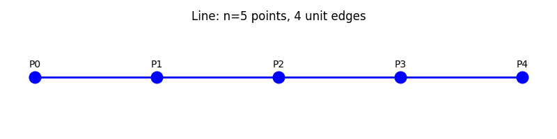
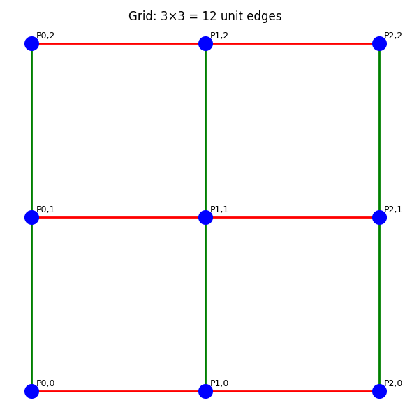
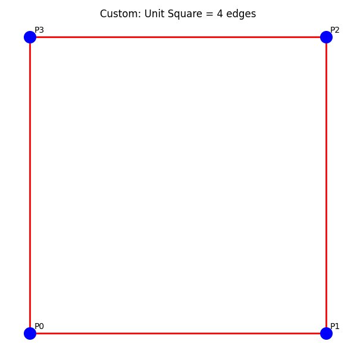
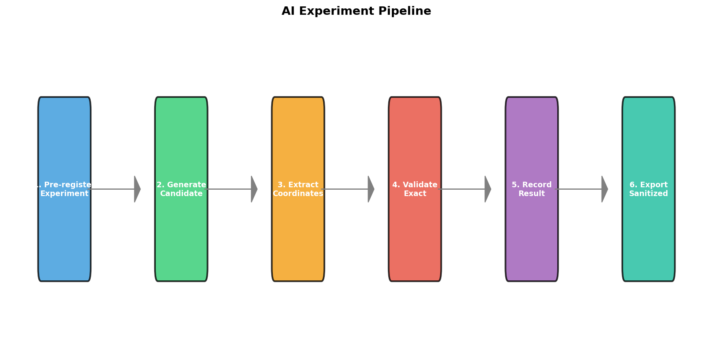
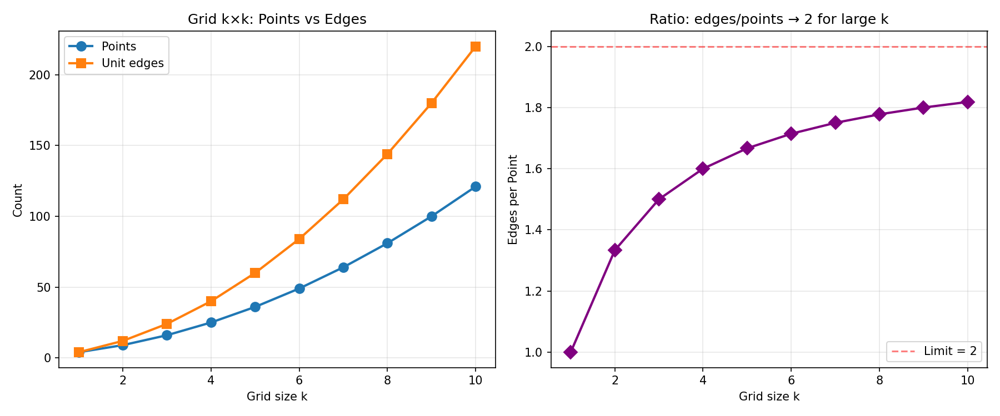

# Counterexample Commons

## An Anti-Capitalist AI-Assisted Mathematics Research Lab

[](LICENSE)
[](https://python.org)
[]()

**Counterexample Commons** is a source-available research laboratory for exact
mathematical validation and controlled AI-assisted exploration.

Its first case study examines the 2026 AI-generated counterexample to Paul
Erdős' planar unit-distance conjecture: a result showing that, for infinitely
many values of n, there exist planar point configurations with at least
n^{1+δ} unit-distance pairs for some fixed δ>0. Will Sawin obtains the
explicit exponent n^{1.014}.

This repository does not treat AI output as proof. It separates
source-documented results from locally reproduced exact calculations,
exploratory model-generated candidates and rejected or failed experiments.

Released under the **Anti-Capitalist Software License (v 1.4)**.
Copyright © 2026 Lino Casu.

---

## 1. Political and Scientific Mission

Mathematics should not become privately enclosed research infrastructure for
corporate extraction or military power. This project supports a
commons-oriented, anti-capitalist approach to technical knowledge.

## 2. First Case Study: Erdős' Unit-Distance Problem

Let u(n) = max unit-distance pairs among n planar points.

- **Line:** n−1 edges. **Grid k×k:** 2k(k−1) edges.
- **Historical:** n^{1+C/log log n} constructions.
- **2026:** AI construction achieves n^{1+δ} (fixed δ>0); Sawin: n^{1.014}.
- **Open:** exact u(n) between n^{1.014} and O(n^{4/3}).

### Visuals


<br>*Line: 5 points → 4 unit edges*


<br>*Grid: 3×3 → 12 unit edges*


<br>*Unit Square: 4 points → 4 unit edges*


<br>*Finite rational mesh baseline (not Sawin's construction)*

## 3. What This Repository Reproduces

| Component | Status |
|-----------|--------|
| Line edge count | LOCALLY_REPRODUCED_EXACT |
| Grid edge count | LOCALLY_REPRODUCED_EXACT |
| Custom finite validation | LOCALLY_REPRODUCED_EXACT |
| OpenAI fixed-δ theorem | SOURCE_DOCUMENTED |
| Finite rational mesh baseline | LOCALLY_REPRODUCED_EXACT |
| Sawin n^{1.014} | SOURCE_DOCUMENTED — not yet locally reproduced |
| AI-generated candidates | AI_GENERATED_HYPOTHESIS |

## 4. What This Repository Does NOT Claim

- Does not reproduce OpenAI's internal model execution
- A finite configuration does not prove an asymptotic theorem
- Sawin's explicit exponent n^{1.014} is source-documented only; not yet locally reproduced
- The rational-mesh code is an exact finite baseline, not Sawin's algebraic-number-theoretic construction
- Does not provide free API-funded research to public visitors

## 5. Claim Status System

[Full definitions](references/CLAIM_TO_SOURCE_MATRIX.md)

`SOURCE_DOCUMENTED` · `LOCALLY_REPRODUCED_EXACT` · `LOCALLY_REPRODUCED_NUMERICAL`
`AI_GENERATED_HYPOTHESIS` · `FORMALLY_VERIFIED` · `REJECTED_OR_FAILED` · `INCONCLUSIVE`

## 6. Main User Interface (Gradio)

Overview · Exact Baselines · Configuration Explorer · AI Candidate Lab ·
Provider Comparison · Claim Registry · Reports & Export · Settings


<br>*AI Experiment Pipeline: From pre-registration to sanitized export*

## 7. Quick Start: Localhost

```bash
pip install -r requirements.txt
python scripts/run_gradio_local.py --mode local-private
```

## 7a. Six Execution Modes

| Mode | Key | AI Labs | Share |
|------|-----|:---:|:---:|
| `local-private` | env file | yes | no |
| `local-share` | none | no | yes |
| `public-demo` | none | no | no |
| `colab-private` | Colab Secrets | yes | no |
| `colab-public-demo` | none | no | yes |
| `hosted-public-demo` | none | no | no |

## 7b. AI Experiment Pipeline

1. **Pre-register** claim and falsifier before generation
2. **Generate** from any provider (manual trigger only)
3. **Extract** candidate coordinates from raw output
4. **Validate** with exact SymPy rational arithmetic
5. **Record** all artifacts (including failed runs)
6. **Export** sanitized reports

### Grid Scaling Analysis


<br>*Grid k×k scaling: Points vs edges → ratio approaches 2*

## 7c. Google Colab Research Lab — Complete Lab Candidate

The previously published multi-notebook Colab layer has been **withdrawn** as a
validated public workflow.

Local execution inside an existing repository checkout was incorrectly treated
as evidence of fresh Google Colab functionality. It is not.

The rescue branch now contains **one complete, end-to-end research lab
notebook** that launches the same Gradio app in safe no-key public-demo mode:

[](https://colab.research.google.com/github/error-wtf/counterexample-commons/blob/rescue/integrated-complete-lab/notebooks/Counterexample_Commons_Complete_Lab_Colab.ipynb)

Current status:

- Previous ten-notebook Colab layer: **deprecated / not validated**
- New complete Colab lab: integrated as a no-key runtime test candidate
- Fresh Google Colab runtime execution by the user: **awaiting validation**
- Live provider/API workflow: not part of the public Colab demo
- Sawin n^{1.014}: SOURCE\_DOCUMENTED only, not locally reproduced

The deprecated prototype notebooks remain in the repository under
`notebooks/` for reference but are not advertised as public workflows.

The complete notebook clones `rescue/integrated-complete-lab` and starts the
same local-first Gradio lab in `colab-public-demo` mode. It must not be read as
evidence that the asymptotic OpenAI/Sawin theorem has been locally reproduced.

## 8. Supported AI Providers (7)

| Provider | Env Var | Local Private | Colab Private | Public Demo |
|----------|---------|:---:|:---:|:---:|
| OpenAI | `OPENAI_API_KEY` | yes | yes | no |
| OpenRouter | `OPENROUTER_API_KEY` | yes | yes | no |
| Ollama Cloud | `OLLAMA_API_KEY` | yes | yes | no |
| Ollama Local | *(none)* | yes | no | no |
| Mistral | `MISTRAL_API_KEY` | yes | yes | no |
| Google Gemini | `GEMINI_API_KEY` | yes | yes | no |
| Anthropic Claude | `ANTHROPIC_API_KEY` | yes | yes | no |

## 9. Sources

| Source | Role |
|--------|------|
| [OpenAI announcement (2026-05-20)](https://openai.com/index/model-disproves-discrete-geometry-conjecture/) | Claim framing |
| [Alon et al., arXiv:2605.20695](https://arxiv.org/abs/2605.20695) | Companion analysis |
| [Sawin, arXiv:2605.20579](https://arxiv.org/abs/2605.20579) | Explicit n^{1.014} |

## 10. License

All original material: **Anti-Capitalist Software License (v 1.4)**.
Copyright © 2026 Lino Casu.

This is source-available anti-capitalist research software, not OSI-defined
open-source software. See [LICENSE](LICENSE), [LICENSE_POLICY.md](LICENSE_POLICY.md),
[THIRD_PARTY_SOURCES_AND_LICENSES.md](THIRD_PARTY_SOURCES_AND_LICENSES.md).

## 11. Contributions

Welcome from individuals, educational contexts, non-profits and cooperatives
consistent with ACSL v1.4. No military, policing, surveillance or exploitative
commercial application work.

## 12. Author

**Lino Casu** — independent anti-capitalist mathematical research.
